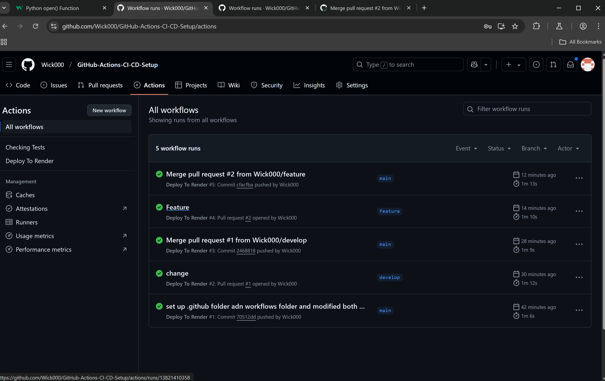

# GitHub-Actions CI-CD Pipeline


## Description

Creating a CI/CD pipeline using GitHub Actions to run the component tests via Cypress when a Pull Request is made to the develop branch, and the application is deployed when code is merged from develop to the main branch.

## Table of Contents

- [Installation](#installation)
- [Usage](#usage)
- [Link](#link)
- [Screenshot](#screenshot)
- [License](#license)
- [Contributing](#contributing)
- [Tests](#tests)
- [Questions](#questions)

## Installation

Run the following command to install dependencies:

```
npm i
```

## Usage

Head to the repo to explore!

## Link

[Click this text to See Deployed Website!!](https://github-actions-ci-cd-setup-k3ao.onrender.com)

## Screenshot




## License

This project is licensed under the MIT license. For more information, see [this link](https://opensource.org/licenses/MIT).

## Contributing

Contact me for questions!

## Tests

Run the following command to run tests:

```
Test run automatically when pushing to GitHub!
```

## Questions

If you have any questions, feel free to reach out to me at [wick9872000@yahoo.com](mailto:wick9872000@yahoo.com). You can also find me on GitHub at [Wick000](https://github.com/Wick000).
